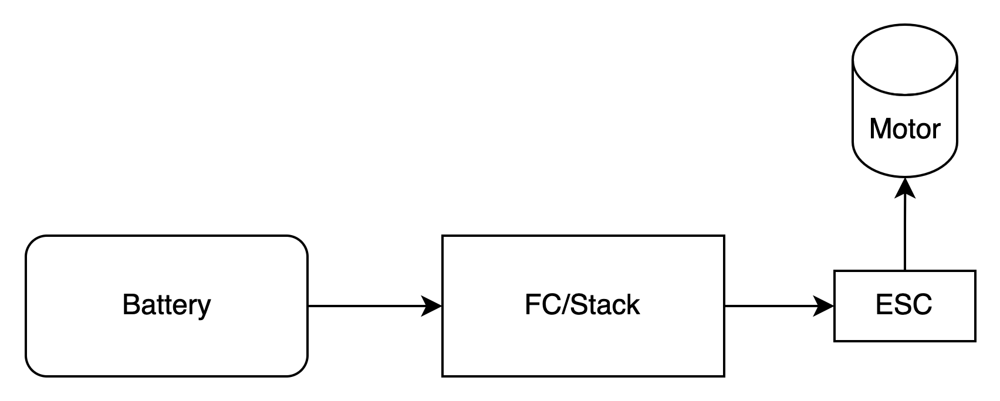

# Flight Electronics

The Ranger 1600 PNP comes with servos, ESC, and motor. I think the typical expectation is to have the ESC plug into the
battery, and the 3 wire ESC cable go to a receiver to power it and the servos. I don't know if that will work with my
setup of Mini Wing F405. Grok tells me the Ranger 1600 comes with an ESC that has a Battery Elimination Circuit - BEC
which will power the FC. The ESC 3 wire plugs into S1 on the FC and should provide 5V maybe up to 3A; where 1A is likely
plenty for the servos and receiver.

The alternative is to use the Power Distribution Board on my Mini Wing 405 and wire it like shown in the 405 documentation.

The first method is simpler and would require no soldering. Maybe I'll try that first. I might be able to forego the PDB
in this case, but I'm going to leave it inplace anyway.

## Battery Choice
Reading up about the Ranger 1600, some say that a 4000 mAh 3S is ideal for weight an balance and has enough thrust.
Others seem to say that for adding FPV gear we will want a 4S battery.

I'll need to pick up a charger, and go through our old bag of LiPos to see if any might still be good.

I think 4S might be the way to go for now as it should provide more than enough - and maybe enough when we get a camera mounted.

## Radio Tx
Wyatt has a Frsky with TBS Crossfire installed. We will try that first.

## Radio Rx
I purchased a TBS Crossfire Nano Pro receiver for about $40. 

## Update Firmware on everything

The radio, the TBS Crossfire Module, the TBS Nano, the Flight Controller, some ESCs - possibly the GPS/RemoteID. All
have firmware with versions.
Making this automatic - and being able to log equipment - will be its own challenge for later.

## Lipo Charger
This looks nice, but misses on the NiCd option.
https://www.e-fliterc.com/product/s100-1x100w-usb-c-smart-charger/SPMXC2090.html  

But, may need one for the Transmitter as well, which is NiCd.
https://www.amazon.com/Charger-Battery-Balance-Discharger-Adapter/dp/B07R18YNZQ. 
This looks better.

## Telemetry

I do not know how telemetry will work. Looks like it goes from plane back to TBS Crossfire and into the Radio Tx, and
maybe if the radio is plugged into the computer it can show up in QGroundControl.

I think about this because live telemetry might let the computer provide additional reasoning.

