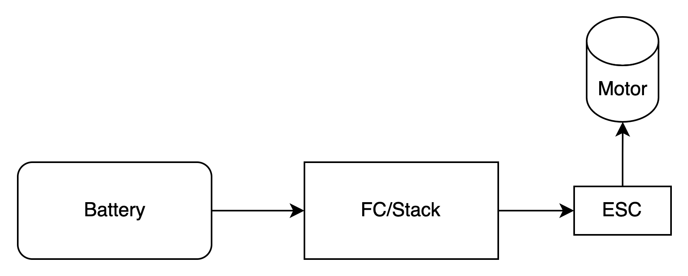

# Flight Electronics

The Ranger 1600 PNP comes with servos, ESC, and motor. I think the typical expectation is to have the ESC plug into the
battery, and the 3 wire ESC cable go to a receiver to power it and the servos. I don't know if that will work with my
setup of Mini Wing F405. Grok tells me the Ranger 1600 comes with an ESC that has a Battery Elimination Circuit - BEC
which will power the FC. The ESC 3 wire plugs into S1 on the FC and should provide 5V maybe up to 3A; where 1A is likely
plenty for the servos and receiver.

**NOTE** likely that this will not support battery voltage monitoring which is built into the flight controller. I could install a low battery buzzer,
or for now, just pay attention to the power. My focus needs to be on getting some data.

The alternative is to use the Power Distribution Board on my Mini Wing 405 and wire it like shown in the 405 documentation.

The first method is simpler and would require no soldering. Maybe I'll try that first. I might be able to forego the PDB
in this case, but I'm going to leave it inplace anyway.

## Battery Choice

Reading up about the Ranger 1600, some say that a 4000 mAh 3S is ideal for weight an balance and has enough thrust.
Others seem to say that for adding FPV gear we will want a 4S battery.

I'll need to pick up a charger, and go through our old bag of LiPos to see if any might still be good.

I think 4S might be the way to go for now as it should provide more than enough - and maybe enough when we get a camera mounted.

## Flight Controller: SpeedyBee F405 Wing Mini

This is about $50 and supports Ardupilot. I discussed with Grok, and this seems like a decent option, thought it has some limitations, mainly I think in size of flash memory.
It does not support a full build of Ardupilot.

See https://oscarliang.com/speedybee-f405-wing-mini-fc/

## Radio Tx

Wyatt has a FrSky with TBS Crossfire installed. We will try that first.  

I think it is the FrSky Taranis Q X7. I'll have to see about the batteries, the SD Card, and updating the software.

FrSky runs OpenTX. We need the OpenTX app to update the Firmware.
https://www.open-tx.org  

To update - hold the trims each in - and super brieif power on. Then plugin USB.

It is possible the Taranis Q X7 charges the LiION via the USB port. Probably NOT.

I flashed opentx-x7-en. Note, I also flashed the wrong stuff and that kept the TX from turning on.
I still get some warnings, including SC Card version warning. I'd like to clear everything.

## OpenTX has ended development.

OpenTX has been superseded by EdgeTX - https://edgetx.org/supportedradios/
But EdgeTX does not support FrSky Taranis Q x7 - so we will use last version of OpenTX

2.3v0039 expected SD Card warning.

### TBS Crossfire Tx module

This is a module on the FrSky, with its own firmware.
Updating.  
https://www.youtube.com/watch?v=Ypn71lIu8l8  

I updated the Crossfire TX using TBS Agent Desktop, which found the receiver and updated it.
It was default for the receiver on first time binding. 
However, I may have messed up selecting FCC mode, as I'm now having trouble binding on power on.
I may factory-reset the Tx module to see if that helps. 
It is a bit of a pain to unlock - and I no longer think I have to, Wyatt showed me it is the model file does not know 
about Crossfire. The light on the back of the Crossfire module needs to be lit up.

## Radio Rx

I purchased a TBS Crossfire Nano Pro receiver for about $40. 

## Update Firmware on everything

The radio, the TBS Crossfire Module, the TBS Nano, the Flight Controller, some ESCs - possibly the GPS/RemoteID. All
have firmware with versions.
Making this automatic - and being able to log equipment - will be its own challenge for later.

## GPS / RemoteID

We need to support RemoteID if we plan to do fly outside designated non-ID areas, and I needed GPS in any event.
Note, that the CRRC fields are designated non-ID, and ceiling of 700 ft. One needs to be an AMA member.

### BeeID M10Q v1.1

From NewBeeDrone.
Get the ID from it, so I can register the Drone.
To configure, power on - press button till it slowly pulses red. Connect with WiFi 

My ID: 2071FF2F6C670F03B80D
Configured as Class 2 - estimated 1Kg weight.

I can see the module with my iPhone using Drone Scanner app.

## Lipo Charger

This looks nice, but misses on the NiCd option.
https://www.e-fliterc.com/product/s100-1x100w-usb-c-smart-charger/SPMXC2090.html  

But, may need one for the Transmitter as well, which is NiCd.
https://www.amazon.com/Charger-Battery-Balance-Discharger-Adapter/dp/B07R18YNZQ. 
This looks better.

## Telemetry

I do not know how telemetry will work. Looks like it goes from plane back to TBS Crossfire and into the Radio Tx, and
maybe if the radio is plugged into the computer it can show up in QGroundControl.

I think about this because live telemetry might let the computer provide additional reasoning.

# Configure a Model File

The Taranis radio needs a model file to go with the wing.
The model needs to know about Crossfire.

# Diagram of whole thing

# Made in USA
NDAA compliant - would be a good way to go.
Yes, there are flight controllers made in the United States. Several companies manufacture flight controllers
domestically, often emphasizing compliance with regulations like the National Defense Authorization Act (NDAA) for use
in government or commercial applications.