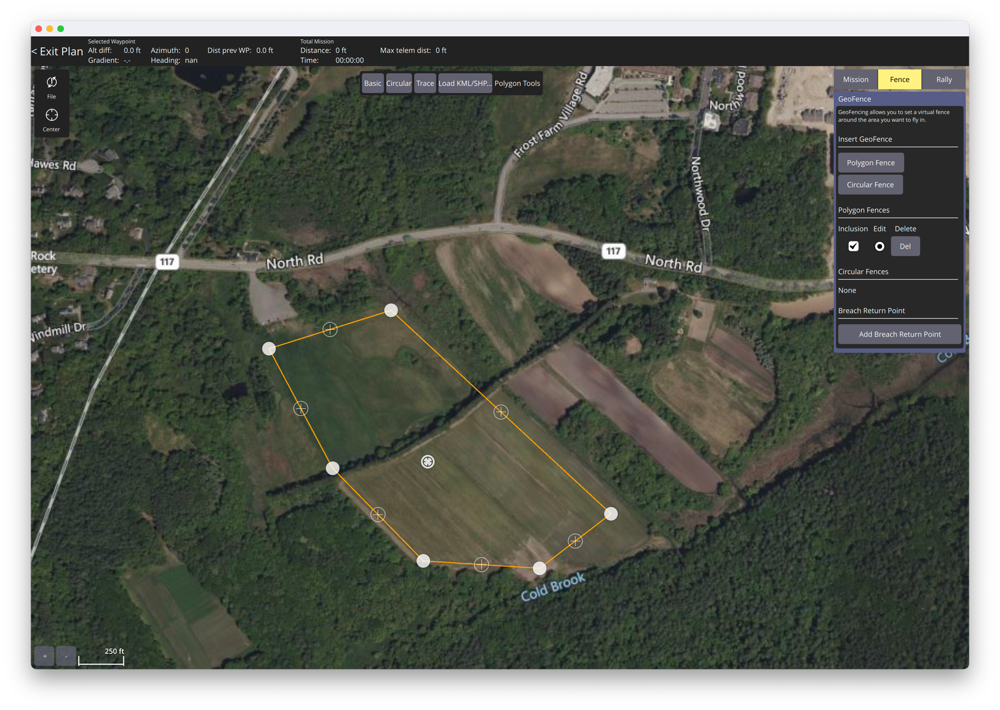
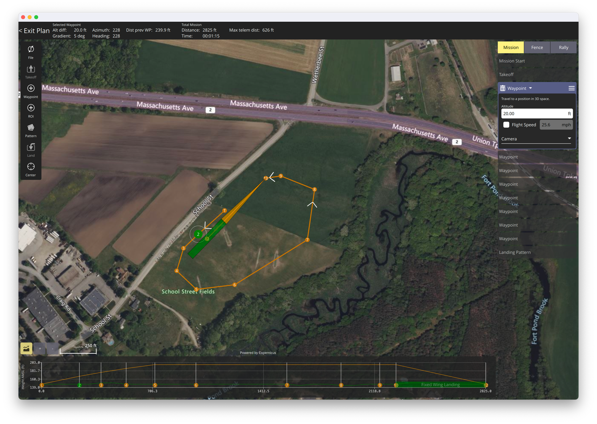

# Flingt Planning 

# QGroundControl (QGC)
QGC runs native on my Mac.

First flight plans Davis Field.

A first pass at a simple loop with launch and landing. Sort of a flight in the pattern.

## School St

# MissionPlanner
This is the bespoke Ardupilot Planner. It provides for some scripting, and other stuff, that I'd like to know about,
but it is Linux based, and a little clunky to run on my Mac, probably ok in Docker.

# On Mac
Looks like Mono on mac will not work - I tried it.
WARNING: The Carbon driver has not been ported to 64bits, and very few parts of Windows.Forms will work properly, or at all.
This looks like a dead end.

Try with XQuartz...  Nope
MONO_MWF_MAC_FORCE_X11=1 mono MissionPlanner.exe

Will try VirtualBox next.       