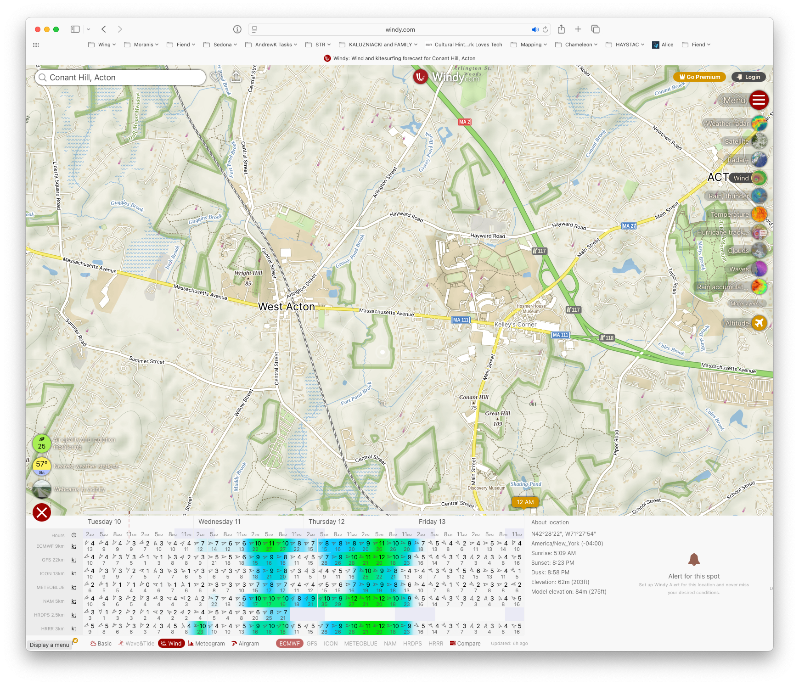

# Weather

It is important to know what weather to expect.

METARs is the standard for aviation, but there are many other sources that might be better suited for RC style flight.

Windy.com gives very nice information for planning in advance.

